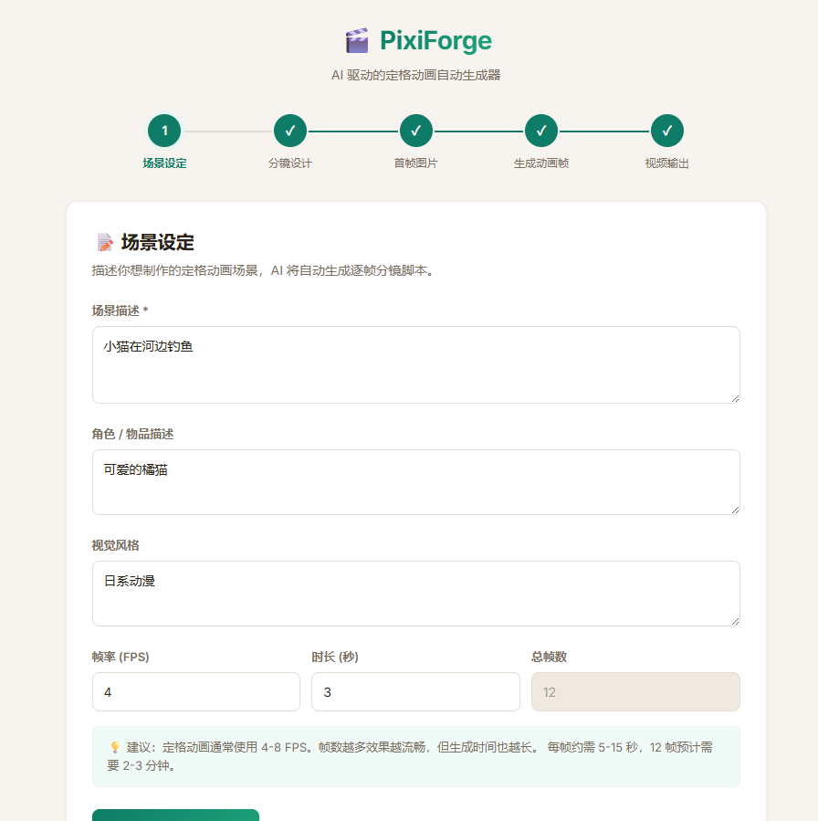
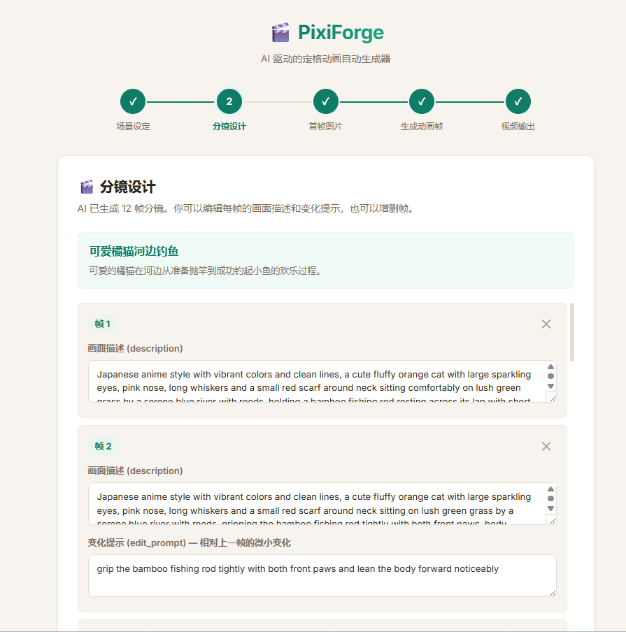
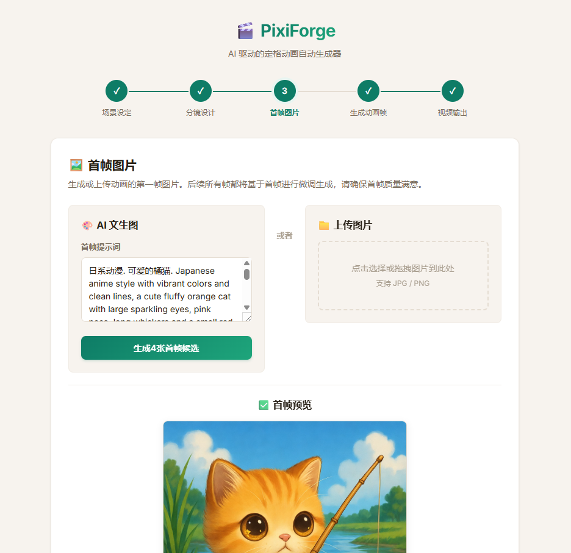
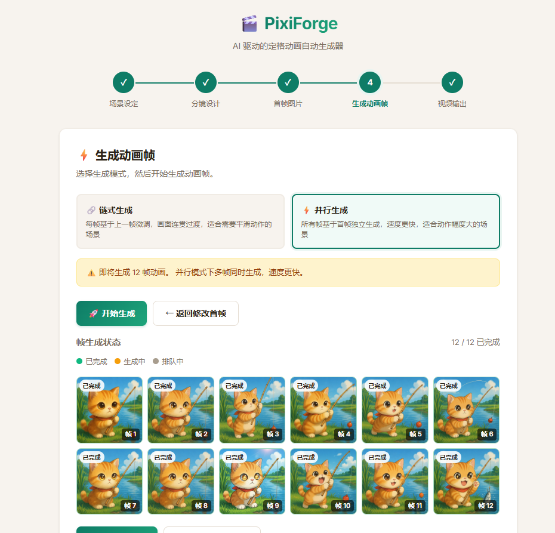
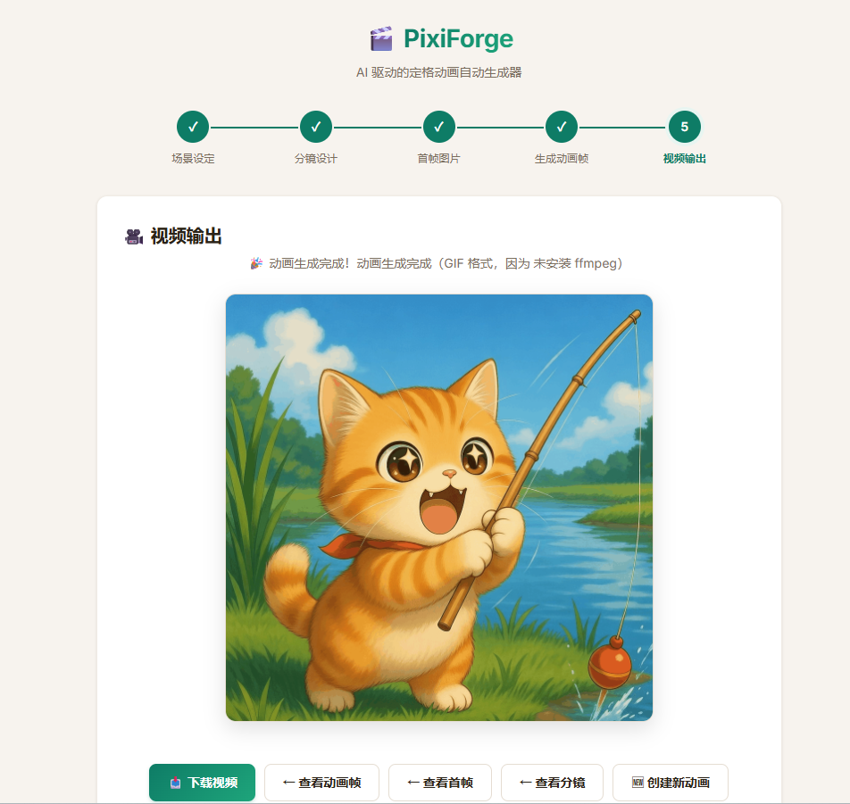

# PixiForge - AI 定格动画自动生成器

使用 AI 大模型自动生成定格动画视频。用户描述场景 → AI 生成分镜 → 逐帧图片编辑 → 合成视频。

## 工作流程

前端提供 **5 步引导式界面**，每一步都有明确提示：

| 步骤 | 说明 |
|------|------|
| ① 场景设定 | 输入场景描述、角色信息、风格、帧率和时长 |
| ② 分镜设计 | AI 生成逐帧分镜，用户可审核/编辑/增删帧 |
| ③ 首帧图片 | AI 文生图或用户上传第一帧（后续帧的基础） |
| ④ 生成动画帧 | 以首帧为基础，AI 图片编辑链式生成每帧（微调上一帧） |
| ⑤ 视频输出 | 将所有帧合成视频（MP4/GIF），预览和下载 |

## 功能预览

按实际界面流程展示如下：

### 1. 场景设定


### 2. 分镜设计


### 3. 首帧图片


### 4. 生成动画帧


### 5. 视频输出


## 技术栈

- **后端**：Python / FastAPI
- **前端**：Vue 3 (CDN) + 原生 CSS
- **AI API**：兼容 OpenAI 格式（文本对话 / 文生图 / 图生图）
- **视频合成**：ffmpeg (MP4) / Pillow (GIF 回退)

## 快速启动

```bash
# 1. 创建虚拟环境
python -m venv .venv
.venv\Scripts\activate       # Windows
# source .venv/bin/activate  # Linux/Mac

# 2. 安装依赖
pip install -r requirements.txt

# 3. 配置环境变量
copy .env.example .env       # Windows
# cp .env.example .env       # Linux/Mac
# 编辑 .env，填入 AI_API_KEY

# 4. 启动服务
uvicorn app.main:app --reload --host 0.0.0.0 --port 8000
```

浏览器访问：`http://127.0.0.1:8000`

## 环境变量

| 变量 | 说明 | 默认值 |
|------|------|--------|
| `AI_BASE_URL` | AI API 基础地址 | `https://grok2api.zyj20200.workers.dev` |
| `AI_API_KEY` | API 密钥（**必填**） | - |
| `AI_CHAT_MODEL` | 文本模型 | `grok-4.1-thinking` |
| `AI_IMAGE_MODEL` | 文生图模型 | `grok-imagine-1.0` |
| `AI_IMAGE_EDIT_MODEL` | 图生图模型 | `grok-imagine-1.0-edit` |

## 项目结构

```
PixiForge/
├── app/
│   └── main.py          # FastAPI 后端（API 路由 + 业务逻辑）
├── static/
│   ├── index.html        # 前端 HTML（Vue 3 模板）
│   ├── css/style.css     # 样式
│   └── js/app.js         # Vue 应用逻辑
├── data/
│   ├── projects/         # 项目数据（分镜、帧、配置）
│   ├── outputs/          # 生成的视频
│   └── uploads/          # 上传的文件
├── requirements.txt
├── .env.example
└── README.md
```

## API 接口

### 项目流程
- `POST /api/projects` — 创建项目
- `POST /api/projects/{id}/storyboard/generate` — AI 生成分镜
- `PUT /api/projects/{id}/storyboard` — 更新分镜
- `POST /api/projects/{id}/first-frame/generate` — AI 生成首帧
- `POST /api/projects/{id}/first-frame/upload` — 上传首帧
- `POST /api/projects/{id}/generate-frames` — 开始帧生成（后台任务）
- `GET /api/projects/{id}` — 查询项目状态（轮询进度）
- `POST /api/projects/{id}/render-video` — 渲染视频

### 工具接口
- `POST /api/chat` — LLM 对话
- `POST /api/images/generate` — 文生图
- `POST /api/images/edit` — 图生图

## 说明

- 项目数据保存在 `data/projects/`，服务重启后自动加载。
- 视频合成优先使用本机 `ffmpeg`，未安装时回退生成 GIF。
- 定格动画建议使用 4-8 FPS，帧间变化应尽量微小以保持连贯性。
- 当前为单机架构，任务状态保存在内存 + JSON 文件中。

## 优化建议

- 用 Redis + Celery 替换内存任务队列
- 增加帧间一致性质检（相似度/闪烁检测）和自动重试
- 增加关键帧 + 补帧策略，降低成本并提升连贯性
- 支持多种视频分辨率和格式导出
